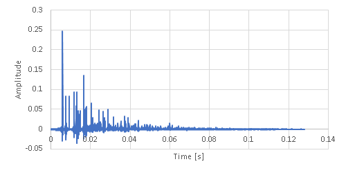

## Room Acoustics Simulation

Room impulse responses can be simulated with the mirror method.

```csharp
// Create a room.
var size = DenseVector.OfArray(new double[] { 4.0, 4.0, 2.0 });
var distanceAttenuation = new DistanceAttenuation(dist => 1 / (dist * dist));
var reflectionAttenuation = new ReflectionAttenuation(freq => 0.8);
var maxReflection = 16;
var room = new Room(size, distanceAttenuation, reflectionAttenuation, maxReflection);

// Place a soud source.
var source = new SoundSource(1.0, 2.0, 1.2);

// Place a microphone.
var mic = new Microphone(3.0, 2.0, 1.2);

// Settings for discretization.
var sampleRate = 16000;
var dftSize = 4096;

// Simulate the RIR.
var rir = MirrorMethod.GenerateImpulseResponse(room, source, mic, sampleRate, dftSize);
```


